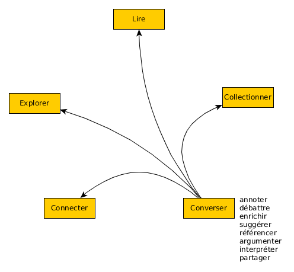

### Fabrique de la revue _Sens Public_
#### la revue scientifique comme espace public
&nbsp;

Nicolas Sauret

<!-- .element: style="font-size:1.5rem" -->

_La publication savante en contexte numérique_ - ACFAS 2017  
12-05-2017

<!-- .element: style="font-size:1.5rem" -->

===

Bonjour à tous,

Je vais vous présenter les réflexions en cours à la chaire sur les écritures numériques, sur ce chantier à première vue très banale de la fabrique d'une revue en ligne, qui elle ne l'est pas.

%%%%%%%%%%%%%%%%%%SECTIONmoveRight%%%%%%%%%%%%%%%%%%
### Sommaire

1. Constats
* Opportunités
* Fabrique de _Sens Public_
* Design de la conversation scientifique

===

Bien entendu le chantier ne l'est pas non plus, c'est ce que je vais essayer de faire passer ici, en faisant d'abord quelques pas en arrière pour mieux sauter dans le sujet et dans les pistes que nous explorons.

%%%%%%%%%%%%%%%%%%SECTIONmoveRight%%%%%%%%%%%%%%%%%%
<!-- .slide: data-background-image="img/senspublic.png" data-background-size="contain"-->

===
La revue Sens Public est ce qu'on appelle un pure player, c'est-à-dire qu'elle est née en ligne sur le web, autrement dit : nativement numérique. C'était en 2003.

Le chantier actuel, presque 15 ans plus tard est donc ce qu'on appelle une refonte, c'est-à-dire qu'il s'agit d'un remaniement complet, tant sur le plan technique qu'éditorial. Il s'agit de reconstruire la revue, et pourquoi pas, en passant, de repenser ce que pourrait être une revue scientifique exploitant pleinement l'environnement numérique.

§§§§§SLIDEmoveDown§§§§§

<i class="fa fa-arrow-right"></i> La communication scientifique en crise

<i class="fa fa-arrow-right"></i> mutation du support d'écriture et de lecture

<!-- .element: class="fragment" data-fragment-index="1" -->

<i class="fa fa-arrow-right"></i> transition épistémologique ?

<!-- .element: class="fragment" data-fragment-index="2" -->

===

Ce chantier se fait **dans un contexte de crise** pour la communication scientifique. Cette crise a de multiples facteurs. Le numérique, en transformant radicalement **le support d'inscription** des connaissances, vient bouleverser les institutions de savoirs puisqu'il vient modifier tout ce sur quoi ces institutions reposent, à savoir les processus de production et de validation des écritures.

C'est l'ensemble du cycle de la recherche qui est touché aujourd'hui, la collecte des données, leurs analyses, la production de connaissances, leur diffusion. A chacune de ces étapes, le numérique, c'est-à-dire tout à la fois, le _processeur_ comme technologie de calcul, le _réseau_ comme technologie de communication, et _le web_ comme technologie de publication, ont suscité de nouvelles pratiques au sein des communautés savantes, **redistribuant les cartes** de l'agencement classique entre institutions, dispositifs et supports et mettant à mal le modèle épistémologique traditionnel.

Nous nous intéresserons ici principalement à cette étape particulière du cycle qu'est la communication scientifique.

<!-- En transformant radicalement le support d’inscription du savoir, le numérique transforme également les dispositifs d’écriture et de lecture, et dans le même temps suscitent de nouvelles pratiques au sein des communautés savantes.
qui nous oblige à revisiter l’agencement classique entre institution, dispositif et support. -->

§§§§§SLIDEmoveDown§§§§§
### un problème institutionnel

<i class="fa fa-arrow-right"></i> déphasage entre les pratiques institutionnelles et les pratiques réelles.

===

Il y a notamment deux constats à faire, deux constats problématiques pour l'institution académique :

1. d'une part, nous observons chez les chercheurs une hybridation de pratiques savantes ou académiques avec des pratiques non-académiques, pratiques qui prennent naissance avec l'émergence de nouveaux dispositifs numériques d’écriture et de lecture, et
2. d'autre part, une certaine dérive (institutionnelle et économique) de la publication, qui a été progressivement soumise à des contraintes et des motivations de natures diverses, mais surtout de plus en plus éloignées de sa mission première, l’élévation des connaissances.

§§§§§SLIDEmoveDown§§§§§

 Privés de savoir ? DataGueule#63 (https://youtu.be/WnxqoP-c0ZE)

<!-- .element class="petit imgvalign" -->

===
Il est inutile de rappeler ici le combat systématique que mènent les éditeurs-rentiers, les éditeurs-goêliers pourrait-on dire, pour élever toujours plus hautes et plus chères les barrières empêchant l'accès à la connaissance. Je vous renvoie simplement à cette excellente vidéo de DataGueule.

En ce qui nous concerne, c'est surtout l'institution qui est en cause, puisqu'elle continue de légitimer et de soutenir un modèle pervers basé sur un leitmotiv : _"publish or perish"_ et sur une métrique, l'_impact factor_, devenus l'alpha et l'omega de tout chercheur ambitieux. Ce qui entretient au passage les mêmes éditeurs-rentiers.

§§§§§SLIDEmoveDown§§§§§

<i class="fa fa-arrow-right fa-rotate-270"></i> explosion des formes d'écritures

<!-- .element: class="fragment" data-fragment-index="2" style="text-align:left"-->

<i class="fa fa-arrow-right fa-rotate-90"></i> asphyxie de la publication traditionnelle

<!-- .element:  style="text-align:left"-->

<i class="fa fa-arrow-right "></i> les lieux et les formes de la controverse  
échappent de plus en plus à l'institution académique.

<!-- .element: class="fragment" data-fragment-index="3" style="text-align:left"-->

===

Nous observons donc deux tendances liées d'une manière très paradoxale : l'asphyxie de la publication traditionnelle qui semble coincée dans des priorités différentes de sa mission première, **et par ailleurs l'explosion des formes d'écritures**, formes qui ne peuvent encore pleinement rentrer dans la sphère institutionnelle, puisqu'elles ne sont pas légitimées par l'institution.

On pourrait penser que la première victime de ce système est la conversation scientifique, pourtant c'est bien l'institution qui en pâtit le plus puisque la conversation, elle, se porte bien, mais hors de la sphère institutionnelle : **les lieux et les formes de la controverse** et du consensus échappent de plus en plus à cette institution.

<!-- intégrer le mot de Larivière (mardi 9 mai 2017) : la revue comme «vecteur de capital symbolique» -->

§§§§§SLIDEmoveDown§§§§§
### un problème éditorial

<i class="fa fa-arrow-right"></i> déphasage entre la nature du texte numérique et ses formes de publications

===

Deuxième constat qui vient en fait éclairer le premier. Sur le plan de l'édition, c'est le déphasage entre les modes traditionnels de publications, et la nature du texte numérique. L'article, l'ouvrage, les actes, et même les colloques, ne sont pas réellement passés au numérique.

Ces formes de communications scientifiques s'ancrent très fortement dans l'ère pré-numérique, que ce soit d'un point de vue économique et juridique (avec une certaine conception des droits d'auteur), ou d'un point de vue technique, avec des savoirs-faire basés sur le papier, le livre et l'imprimerie.

De manière très naturelle, ces savoirs-faire ont continué à déterminer les artefacts numériques de l'article ou de l'ouvrage. Cette continuité est dans une certaine mesure nécessaire et bienvenue, mais elle vient aujourd'hui gripper les possibilités et les opportunités qu'offre l'environnement numérique, notamment pour fluidifier et enrichir la conversation scientifique.

%%%%%%%%%%%%%%%%%%SECTIONmoveRight%%%%%%%%%%%%%%%%%%
### Des opportunités à saisir

<i class="fa fa-arrow-right"></i> quelles modalités d'écriture,  
d'édition, de publication, de conversation ?

<i class="fa fa-arrow-right"></i> vers une épistémologie du numérique ?

===

Quelles sont les pistes et les opportunités que le numérique nous engage à saisir ?

Le support numérique présente des caractéristiques qui laissent entrevoir des modalités d'écriture, d'édition, d'évaluation, de publication, mais aussi de conversation.

§§§§§SLIDEmoveDown§§§§§

  * évaluation ouverte, semi-ouverte et continue,
  * édition continue, itérative
  * édition collaborative
  * enrichissement sémantique du texte
  * support computationnel (Spiral + Voyants)
  * diversification des formes et des formats
  * élargissement de la communauté de savoir
  * porosité entre communautés
  * organiser la conversation : espace critique

===

Ces modalités nouvelles nous permettent d'envisager l'élaboration d'un modèle épistémologique propre au support numérique.

Les recherches de Geoffrey et les expérimentations d'outils d'écriture tels que Spiral vont exactement dans ce sens.

Je ne m'arrête pas sur toutes ces modalités, j'en liste ici quelques unes, qui ne sont d'ailleurs pas toutes sur le même plan, mais à titre d'exemple, je voudrais développer un point qui est revenu plusieurs fois dans nos ateliers de travail, avant de rentrer dans le coeur de la proposition que nous faisons avec le site Sens Public.

§§§§§SLIDEmoveDown§§§§§

### liquidité/stabilité

 <button type="button">Edit</button>

 <!-- .element: class="fragment" data-fragment-index="1" style="font-size:2rem;" -->

[v1.0](http://nicolassauret.net) <!-- .element: style="color:blue;" -->  
[v1.1](http://nicolassauret.net) <!-- .element: style="color:blue;" -->  
[v1.2_JCG](http://nicolassauret.net) <!-- .element: style="color:blue;" -->

 <!-- .element: class="fragment" data-fragment-index="2" style="font-size:1rem; color:red;" -->

===

Une des propriétés du support numérique, implémentée notamment dans le protocoles HTTP du web, est l'instabilité intrinsèque du texte numérique. Cela vient changer la nature même du texte et lui conférer une certaine liquidité.

Une fois publié en ligne, un texte peut en effet **toujours être modifié, amélioré**, enrichi, soit par l'auteur du texte, mais aussi pourquoi pas par la communauté de lecteurs. L'environnement numérique nous permet bien d'éditer de manière continue les textes.

Ce changement de nature vient disrupter la notion de référence et tout le système bibliographique qui s’est mis en place pour l’institutionnaliser. Or cette référence et son institutionnalisation sont les conditions du partage d’un socle commun de connaissances au sein d’une communauté de savoir. La possibilité de s’y référer procure au texte stabilisé une autorité et une authenticité nécessaires à une réflexion commune.

§§§§§SLIDEmoveDown§§§§§

 <!-- .element: class="noborder" width="60%" style="margin: 0 0;"-->
 <!-- .element: class="noborder" width="60%" style="margin: 0 0;"-->

===

Pourtant, on sait aujourd'hui stocker, tracer, indexer et référencer les multiples versions d'un texte en édition continue.

Wikipédia en est l'exemple le plus évident, mais d'autres initiatives existent et vont dans ce sens, à des stades plus ou moins expérimentaux. Ces initiatives [mettent en œuvre des technologies de publication permettant justement de gérer à la fois le texte liquide, son versionning (le traçage de ses différents états et statuts), et même sa discussion. C’est bien sûr le cas du wiki qui ouvre l’accès à toutes les versions antérieures du texte. C’est aussi le cas de la blockchain, conçue pour assurer la comptabilité des écritures et de leurs auteurs (machines et humains). C’est encore le cas de Git ou de Github, avec un protocole de contribution encore différent et sur lesquels émergent plusieurs dispositifs d’écriture collaborative.]

On saurait donc en théorie reconstruire un système bibliographique, c'est-à-dire un système solide de référence nécessaire au partage d'un socle commun de connaissance, et cela nous permet d'envisager un modèle épistémologoqie embrassant pleinement cette liquidité du texte.

Dans cette phase de transition où les modèles papier et numérique cohabitent et s'hybrident, les choses ne sont pas si simples, et la stabilité du texte, même si celui-ci est mauvais, prime encore, notamment pour des raisons institutionelles.

    <!-- _Une des propriétés du support numérique étant notamment l’instabilité intrinsèque du texte, peut-on envisager un modèle épistémologique embrassant pleinement la liquidité du texte, dont chaque version pourrait être stockée, tracée, publiée, discutée ?

    _Plusieurs initiatives existent et vont dans ce sens, à des stades plus ou moins expérimentaux et explorant différentes pistes, notamment celle de l’évaluation ouverte et continue, ou encore un Journal scientifique libre sur plateforme wiki.

    Ces initiatives mettent en œuvre des technologies de publication permettant justement de gérer à la fois le texte liquide, son versionning (le traçage de ses différents états et statuts), et même sa discussion. C’est bien sûr le cas du wiki qui ouvre l’accès à toutes les versions antérieures du texte. C’est aussi le cas de la blockchain, conçue pour assurer la comptabilité des écritures et de leurs auteurs (machines et humains). C’est encore le cas de Git ou de Github, avec un protocole de contribution encore différent et sur lesquels émergent plusieurs dispositifs d’écriture collaborative.
    Socle commun

    Pour Gérard W., à l’état liquide ou solide, tout texte doit être considéré comme un état provisoire de sa recherche, elle-même en transformation permanente. Malgré la pertinence de cette remarque, la publication dans le modèle classique, c’est-à-dire la mise en public d’un écrit, engage véritablement son auteur dans un rapport à l’autre, dans un positionnement intellectuel et politique bien particulier. Le texte liquide, c’est-à-dire le texte agencé à un dispositif d’édition continue, perd en quelque sorte une part de cet engagement, ou plus exactement diminue la force de cet engagement. De déclaration, le texte liquide devient proposition. Proposition modifiable, remplaçable, jetable.

    Ce que le texte liquide vient ainsi disrupter, c’est la référence et tout le système bibliographique qui s’est mis en place pour l’institutionnaliser. Or cette référence et son institutionnalisation sont les conditions du partage d’un socle commun de connaissances au sein d’une communauté de savoir. La possibilité de s’y référer procure au texte stabilisé une autorité et une authenticité nécessaires à une réflexion commune._ -->

 <!-- et d'en contrôler l'édition, c'est-à-dire par exemple

  * liquidité du texte : quel système de références : besoin de stabilité
  * revue ouverte, semi-ouverte et continue
  * édition continue : proposer de nouveaux états du texte, l'ouverture à la contribution, quitte à bouleverser l'auctorialité.
  * exposer les données et mobiliser la communauté
  * organiser la conversation -->

%%%%%%%%%%%%%%%%%%SECTIONmoveRight%%%%%%%%%%%%%%%%%%
### Fabrique de _Sens Public_
===
Sens Public en tant que revue a porté dès son origine une vision tout à fait unique dans le paysage des revues. Née hors de l'institution académique, c'est-à-dire vouée à une certaine liberté de ton et de forme, SP a inscrit dans son ADN une mission et des valeurs qui résonnent aujourd'hui avec les constats que l'on a identifié.

Le projet actuel de refonte n'est pas donc pas hors-sol et ne vient pas bouleverser la philosophie de la revue. Au contraire, il s'en nourrit, et par un effet de miroir et de renforcement mutuel, on pourrait dire que la refonte cherche à revitaliser les valeurs initiales de la revue, au moment où la revue se réinstitutionnalise.

Dans le cadre de la chaire sur les écritures numériques, la démarche est donc double :

§§§§§SLIDEmoveDown§§§§§

<i class="fa fa-arrow-right"></i> implémenter les opportunités du numérique : proposer un modèle alternatif d'édition savante

<!-- .element: style="text-align:left"-->

<i class="fa fa-arrow-right"></i> implémenter l'ADN de _SP_ dans son dispositif d'écriture, d'édition et de diffusion.

<!-- .element: class="fragment" data-fragment-index="2" style="text-align:left"-->

===

Dans le cadre de la chaire sur les écritures numériques, la démarche est donc double :

* implémenter les opportunités du numérique en proposant un modèle alternatif d'édition savante
* implémenter l'adn de le revue dans son dispositif d'écriture, d'édition et de diffusion.

La revue s'est créée sous l'impulsion de Gérard Wormser avec plusieurs horizons

* la transdisciplinarité et approches hybrides
* le multilinguisme et pluralité des langues, avec l'idée de dépasser les territoires dont nous parlait Jean Claude Guédon, d'intégrer des voix et des opinions plus lointaines
* une conscience et une réflexion sur les transformations de l'espace public, travaillé notamment par les supports d'écriture et de lecture numérique.

ici, je regrette un peu de ne pas avoir eu le temps de développer la réflexion sur l'espace public, je pense que ce sera pour une prochaine communication.

Ces différents horizons sont en fait au service d'une seule et même : la communauté Sens Public. COmmunauté que notre refonte souhaite remettre au centre de la revue.

§§§§§SLIDEmoveDown§§§§§

 <!-- .element: class="noborder" width="70%"-->

===

Nous avons identifié 5 axes qu'il faut appréhender comme les éléments complémentaires d'un horizon de possibles pour la communauté de la revue.
La plateforme SP doit permettre de lire, d'explorer, de discuter, de collectionner, de connecter.

§§§§§SLIDEmoveDown§§§§§

#### 1. Lire <!-- .element: class="divleft" -->

 <!-- .element: class="divright, noborder" width="65%"-->

===

Le premier axe «Lire» repose sur les textes eux-mêmes. Il consiste à rendre accessible le corpus des articles de la revue sous différents formats, sans restriction ni barrière mobile.

C'est l'axe le plus évident et le plus classique, mais plus nécessairement l'axe majoritaire en terme d'engagement, comme on va le voir.

<!-- Les articles seront stockés au format XML, exposés avec leurs métadonnées par le biais du framework Synopsx, permettant de construire une API sur un corpus de ressources XML. -->

§§§§§SLIDEmoveDown§§§§§
#### 2. Explorer <!-- .element: class="divleft" -->

 <!-- .element: class="divright, noborder" width="70%"-->
===

Le second axe «Explorer» consiste à multiplier les passerelles entre les ressources du site et hors-site. Il s'agit de mettre à jour le réseau de documents que tissent en arrière-plan les métadonnées associées.

Chaque ressource du site sera ainsi l'occasion de proposer des navigations au sein du corpus mais aussi vers l'exterieur, selon plusieurs parcours :

* la méta-navigation de la revue
* des rebonds internes (d'article à article)
* des rebonds externes en exploitant la richesse sémantique des articles, liée à diverses autorités. Ces éléments doivent permettre d'effectuer des requêtes précises dans des moteurs spécialisés, notamment rechercheisidore.fr.
* des rebonds internes à travers les annotations (voir axe 3), les collections (voir axe 4) et les connexions (voir axe 5)

§§§§§SLIDEmoveDown§§§§§
#### 3. Converser <!-- .element: class="divleft" -->

 <!-- .element: class="divright, noborder" width="65%"-->
===

Le troisième axe «Converser» est probablement l'axe principal au service d'un modèle nouveau pour la revue en ligne. Il s'agit de refaire de la revue un espace de discussion, un espace public où le débat des idées prime sur la forme de publication de ces idées.

Autrement dit en considérant que la scientificité n'est pas (n'est plus) garantie par des formes de publication institutionnelle, et que cette même scientificité gagnera qualitativement en intégrant de nouvelles formes de contributions au débat scientifique.

D'un point de vue très concret, la conversation s'implémente bien entendu à travers des dispositifs d'annotation intra-textuel, mais vient aussi s'installer de manière plus globale dans le site. Nous allons voir cela un peu plus loin.

L'objectif de cet axe est de susciter des lectures critiques, d'outiller la dynamique critique, de manière à ce que cet espace public que tend à devenir la revue, soit aussi un espace herméneutique.

_Un effort particulier de conception et de présentation de cette conversation doit être apporté. Il faut prévoir à la fois une intégration fine et ergonomique des textes et de leur conversation, et à la fois la possibilité de changer de point de vue et d'adopter celui de la conversation. De cette manière, la conversation est susceptible de ne pas être accessoire aux textes, mais de devenir le point d'accroche de la communauté de lecteurs, de développer une pratique critique collective, ainsi que des dialogues inter-culturels (en considérant des passerelles linguistiques). La conversation et les articles peuvent alors constituer les deux faces d'une même pièce.

Un des objectifs de cet axe «Converser» est de susciter une démarche critique dans les pratiques d'annotations. Une piste à explorer pourrait être de catégoriser[^categoriser] les annotations et la conversation en général. Mais la dynamique critique, en tant que démarche d'appropriation, pourrait également se manifester dans l'axe «Collectionner»._

§§§§§SLIDEmoveDown§§§§§
#### 4. Collectionner <!-- .element: class="divleft" -->

 <!-- .element: class="divright, noborder" width="70%"-->
===

Toujours dans une optique d'appropriation, l'axe _collectionner_ offre une démarche critique complémentaire à celle de la conversation.

Collectionner consistera pour le lecteur à constituer des collections de fragments, de textes et de contributions et de les rendre public (de les publier) comme un ressource nouvelle.

Si la collection ne relève pas de la production d'un texte nouveau, elle relève bien malgré tout d'une démarche critique dans la mesure où le lecteur construit sa propre interprétation d'un champs ou d'un concept, en y agrégeant des éléments de connaissances glânés au fil de ses lectures. C'est l'association de ces éléments qui est herméneutique, au sens où il construit du sens.

L'idée de la collection est encore à l'étude. On peut l'imaginer publique comme éditorialisation communautaire ou privé, comme simple outil de travail.

Dans cet axe, on reconnaît la contribution théorique de Milad Doueihi lorsqu'il identifie le caractère anthologique de la culture numérique.

<!-- Une collection publique revient à un acte de publication par lequel le lecteur se fait éditeur de fragments en proposant un chemin de lecture propre. -->

§§§§§SLIDEmoveDown§§§§§
#### 5. Connecter <!-- .element: class="divleft" -->

 <!-- .element: class="divright, noborder" width="65%"-->
===

Cet axe a pour objectif de favoriser la création d'un espace conversationnel en identifiants les connexions et provoquant la mise en relation entre auteurs et lecteurs d'une part, mais aussi au sein de la communauté de lecteurs, et par extension avec les personnes impliquées indirectement dans les articles (par voie bibliographique notamment).

Comme l'axe «Explorer» qui s'appuie sur le réseau des documents et des contributions, l'axe «Connecter» vient exploiter le réseau d'individus induits par les contributions, qu'elles qu'elles soient : articles, annotations, collection, ressource connexe, etc.

Il s'agit de mobiliser la communauté grâce à des moyens de sollicitations spécifiques, très concrètement des notifications aux différents acteurs concernés, gérées de manière fine par une "gestion de communauté" (community management) à la fois humaine et algorithmique. Je ne développe pas aujourd'hui cet aspect de community management pour une telle plateforme car nous n'avons pas encore travaillé à son design, mais ce sera évidemment un point essentiel de la réussite.

<!-- Cet axe repose à nouveau sur la richesse sémantique des métadonnées de l'article (ou des annotations), par exemple de la bibliographie, permettant d'identifier des individus et d'effectuer des requêtes sur différents services (Orcid, Zotero, Twitter, GG Scholar), et finalement de générer semi-automatiquement des notifications aux différents acteurs en présence (auteur de l'article, auteurs cités, lecteurs). -->

§§§§§SLIDEmoveDown§§§§§
### 2 espaces

| Documentaire | Conversationnel |
| :-: |:-:  |
| axé sur les articles | axé sur les échanges sociaux |

<!-- .element: class="tableau" -->

===

Ces cinq axes définissent les grands principes de fonctionnement du site. Ces principes auront valeur de _matrice dispositive_, dont un des enjeux majeurs reste l'éditorialisation du social et son articulation avec le documentaire.

Notre premier objectif consiste finalement à ouvrir au cœur de la revue un espace conséquent pour la conversation. L'espace de la revue serait donc à partager entre les articles, artefacts traditionnels de la revue, et la conversation.

On pourrait bien-sûr adopter une approche encore plus radicale et imaginer une revue qui ne serait que conversation. La question a été posée d'installer par exemple une instance Mastodon dédiée.

Mais pour le moment, la solution que nous envisageons instaure une cohabitation radicale de deux espaces, l'un documentaire, l'autre conversationnel. Le premier espace est organisé de façon très classique, centré sur les articles, eux-mêmes agencés en dossier et en rubriques. Le second espace, social et conversationnel est agencé autour de problématiques soulevées par la revue.

Pour nous aider à visualiser ces deux modalités de la revue, on peut les penser comme les deux faces indissociables et complémentaires d'une même pièce, qu'il suffirait de retourner dans un sens ou dans l'autre selon la _vue_ à laquelle on souhaite accéder.

En fait, on parle bien du même espace, mais selon la porte d'entrée que l'on emprunte, les données s'organisent différemment, les architectures sont différentes. Autrement dit, on accède à deux _projections_ différentes du même espace, d'un même ensemble de contenus, l'une mettant l'accent sur les échanges sociaux, et l'autre sur les productions documentaires.

Ces deux projections sous-tendent un réseau de données liées et des passerelles jalonnant les interfaces du site pour passer de l'une à l'autre. C'est dans ce maillage que réside tout l'enjeu de cette éditorialisation à double entrée.

%%%%%%%%%%%%%%%%%%SECTIONmoveRight%%%%%%%%%%%%%%%%%%
### Du design de la conversation à l'éditorialisation du social

===

Arrêtons nous maintenant sur l'éditorialisation du social :

§§§§§SLIDEmoveDown§§§§§
### Crystal of Knowledge

> "Let us transmute the "frozen moments" that were brought up earlier in the text into a slightly more material metaphor, that of "Crystals of knowledge". Crystals of knowledge should be an important part of how to frame the Great Conversation. Multi-carat crystals are quite acceptable, of course. In fact, defining the range of these "crystals" will be important, and it will require empirical testing."  

> Stern, Niels, Jean-Claude Guédon et Thomas Wiben Jensen. « Crystals of Knowledge Production. An Intercontinental Conversation about Open Science and the Humanities ». Nordic Perspectives on Open Science 1, no 0 (23 octobre 2015), 1‑24. doi:10.7557/11.3619. <!-- .element: class="petit" -->

===

Une notion nous a aidé à concevoir cet espace conversationnel. Le «Cristal de connaissance» est introduit par JC. Guédon dans un article curieux, un article en forme d'échange d'emails, de conversation justement, entre JC Guédon et Thomas Jensen, directeur de revue, débattant de ce que devrait être une revue scientifique aujourd'hui.

Pour TJ, l'article était nécessaire, sur le plan institutionnel d'une part, mais aussi sur le plan scientifique, car il procédait à une fixation du discours scientifique nécessaire à la recherche.

Pour JC Guédon, il fallait au contraire remettre en question la forme même de l'article, et tendre vers des formats plus petits, afin de liquéfier la conversation scientifique. Mais avec l'idée que ces formats seraient susceptibles de s'agréger en cristaux dans un processus de cristallisation proche de la fixation du discours scientifique, mais de manière temporaire.

On voit bien la tension entre les différentes temporalités et matérialités :
* la temporalité et la matérialité d'un article
* les temporalités et matérialités des différentes formes d'échanges: tchat, email, au café, annotations, évaluations d'articles, etc.

Fluidifier tout en cristallisant, il y a là une alchimie très fine, une potion magique peut-être ?, un dosage du temps et des formes qui reste à trouver.

[voir l'entretien avec Jean-Claude Guédon](http://nicolassauret.net/carnet/2017/04/12/entretien-avec-jean-claude-guedon-on-crystal-of-knowledge/)

[^guedon]: Stern, Niels, Jean-Claude Guédon et Thomas Wiben Jensen. « Crystals of Knowledge Production. An Intercontinental Conversation about Open Science and the Humanities ». Nordic Perspectives on Open Science 1, no 0 (23 octobre 2015), 1‑24. doi:10.7557/11.3619.

§§§§§SLIDEmoveDown§§§§§

 <!-- .element: class="noborder" -->

===

Sur la forme, nous n'en sommes encore qu'au stade des premiers croquis. Vos réactions à chaud seront donc les bienvenues.

Nous imaginons ce cristal comme un objet à part entière dans la facette conversationnelle. Il est caractérisé par des mots-clés, et un titre, sous forme de problématique ou de controverse à adresser-.

Selon une temporalité à définir, le cristal agrégera et organisera différents fragments internes ou externes au site :
  * un ou plusieurs fil.s de discussion.s directement associé au cristal
  * des annotation.s d'article et leur fil de discussion
  * fragments d'article, articles, etc.
  * des ressources externes :  post de blogs, tweets, articles, etc.

mais aussi :
  * les personnes impliquées dans la conversation
  * les auteurs invoqués

Ce schéma est un tout premier jet, il ne montre pas l'écosystème de plateformes que le cristal vient moissonner, les référentiels, les dépots, les indexes, il ne montre pas les différentes API, dont l'API qui requête l'archive Sens Public des articles.

Si ce schéma montre simplement les éléments et les fragments constitutifs, leur éditorialisation reste encore à designer, à implémenter, à tester, et à enrichir. La question de son archivage mérite d'être posée, en lien avec son cycle de vie, dans le sens d'une forme longue, mais longue de sa temporalité et non de sa spatialité.

La dimension temporelle du flux de la discussion reste structurante, mais doit s'articuler, on l'a dit, avec une dimension spatiale, celle de l'agencement des différents fragments du cristal.

§§§§§SLIDEmoveDown§§§§§
<!-- ### articulation des éditorialisation algo/éditoriale/communautaire -->

 <!-- .element: width="70%" -->

Triangulation : communauté - média - technologie (source : [O. Ertzscheid](https://www.slideshare.net/olivier/editorialisation))

<!-- .element: class="petit" -->

===

Le cristal doit être pensé comme la cristallisation de fragments autour d'une problématique donnée, qu'elle soit identifiée par l'équipe éditoriale ou par la communauté.

Cette cristallisation sera nécessairement le résultat d'une éditorialisation à la fois :

1. éditoriale, au sens : gérée par l'équipe éditoriale de la revue : sélection de mots-clés, paramétrage de l'algorithme, mise en avant d'éléments pertinents (fils de discussion)
2. communautaire : contributions de contenus (ressources et fragments), vote/classement des différents fragments, suggestion de problématique voir création de cristal.
3. algorithmique : extraction, classement et agencement des différents fragments (requêtes API).

Je reprends ici le schéma d'Olivier Ertzscheid qui nous présentait le 20 avril dernier ce qu'il appelle _les lignes de front éditoriales_, c'est-à-dire comment la communauté, l'éditeur et les algorithmes d'indexation et de recommandation interagissent et se partagent la sélection et l'agencement des contenus.

Il y a une vrai question à se poser ici sur la fonction éditoriale, qui bien sûr ne disparait pas avec le numérique, mais qui a simplement été transférée pour une part plus ou moins grande selon les plateformes, soit dans les mains de la communautés, c'est le cas de Reddit par exemple, soit dans les mains de la machine, c'est le modèle de Facebook par exemple.

Je cite ces deux exemples car dans ce contexte de crise de la vérité, c'est-à-dire aussi, crise de la fonction éditoriale, détenue traditionnellement par des instances à l'autorité légitime, Reddit et Facebook représentent deux extrêmes dans lequel une revue scientifique ou l'institution scientifique en générale ne peut pas tomber. Il faut trouver un entre-deux, une ingénierie ou un design du social.

La résilience de Wikipedia face aux fake news est un très bon exemple de design ou d'alchimie réussi.

§§§§§SLIDEmoveDown§§§§§
 <!-- .element: width="80%" -->

https://fr.wikiversity.org/wiki/Projet:Journal_scientifique_libre

<!-- .element: class="petit" -->

===
J'en profite pour évoquer les initiatives comme celle-ci, de journal scientifique libre sur plateforme wiki.

Sur cette question précise de la fonction éditoriale, quel pourrait être le rôle éditorial de l'équipe éditoriale d'une revue-espace public ? Est-elle relégué à mobiliser, notifier, modérer ?
Est-elle légitime pour décider de la cristallisation et de la dissolution de telle ou telle problématique ? Est-elle simplement destinée à orchestrer dans le temps ces cristaux, de la même manière qu'un média couvre un sujet d'actualité ?

Je termine sur ces questions ouvertes qui mériteraient à ce stade de notre réflexion davantage un atelier de travail qu'une séance de question.

%%%%%%%%%%%%%%%%%%SECTIONmoveRight%%%%%%%%%%%%%%%%%%

### Merci !

à suivre sur [nicolassauret.net/carnets](http://nicolassauret.net/carnets)

<!-- .element: class="petit" -->

&nbsp;

 <!-- .element: class="logo" -->

&nbsp;

